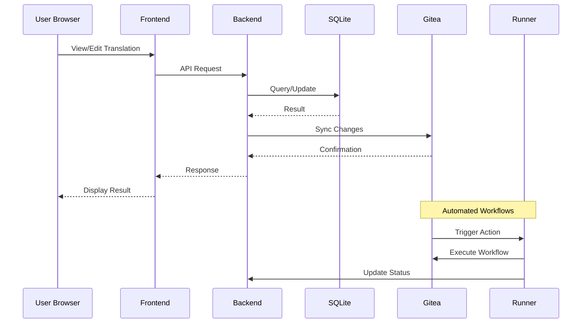
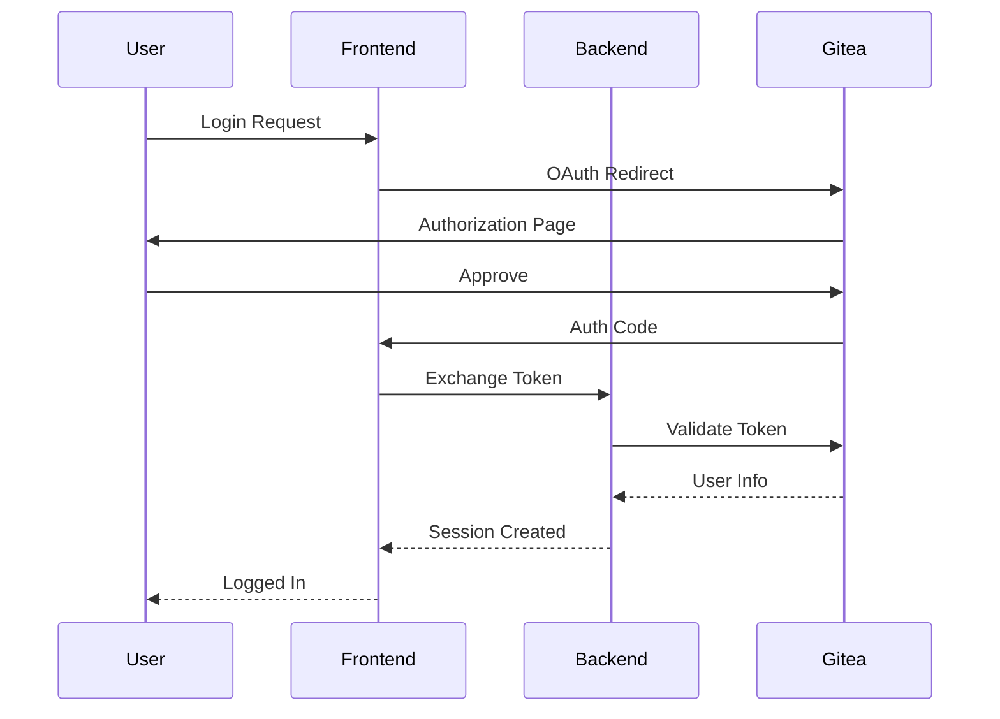
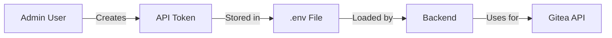
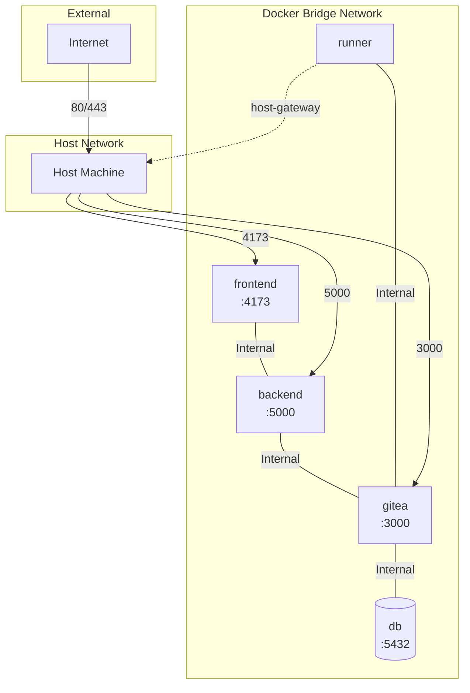
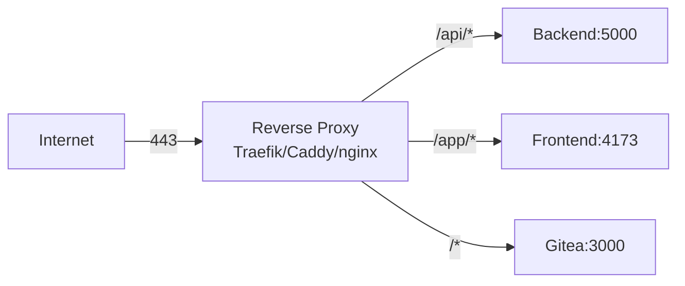

# Architecture Overview

This document provides a comprehensive overview of the Marine Term Translations (MTT) Platform architecture, including component interactions, data flow, and external service integrations.

## Table of Contents

- [High-Level Architecture](#high-level-architecture)
- [Component Descriptions](#component-descriptions)
- [Data Flow](#data-flow)
- [API Architecture](#api-architecture)
- [Authentication Flow](#authentication-flow)
- [External Services](#external-services)
- [Network Architecture](#network-architecture)

---

## High-Level Architecture

```mermaid
graph TB
    subgraph "Client Layer"
        Browser[Web Browser]
    end

    subgraph "Container Network"
        subgraph "Frontend Service"
            FE[Vite + React<br/>:4173]
        end

        subgraph "Backend Service"
            BE[Express.js API<br/>:5000]
            Swagger[Swagger Docs<br/>/api/docs]
        end

        subgraph "Git Service"
            Gitea[Gitea<br/>:3000]
        end

        subgraph "Database Layer"
            PG[(PostgreSQL<br/>Gitea DB)]
            SQLite[(SQLite<br/>Translations DB)]
        end

        subgraph "CI/CD"
            Runner[Act Runner]
        end
    end

    subgraph "External Services"
        Gemini[Google Gemini API]
        EMODnet[EMODnet APIs]
    end

    Browser --> FE
    Browser --> BE
    Browser --> Gitea
    FE --> BE
    BE --> Gitea
    BE --> SQLite
    Gitea --> PG
    Runner --> Gitea
    FE -.-> Gemini
    BE -.-> EMODnet

    style FE fill:#61dafb,stroke:#333
    style BE fill:#68a063,stroke:#333
    style Gitea fill:#609926,stroke:#333
    style PG fill:#336791,stroke:#333
    style SQLite fill:#003b57,stroke:#333
```



---

## Component Descriptions

### Frontend (Vite + React)

| Attribute | Value |
|-----------|-------|
| **Technology** | React 18, Vite 6, TypeScript |
| **Port** | 4173 (preview mode) |
| **Container** | `marine-frontend` |
| **Purpose** | User interface for translation management |

**Key Features:**
- Translation browsing and editing interface
- User authentication via Gitea OAuth
- Real-time translation status updates
- Gemini AI integration for translation suggestions

**Configuration:**
- `VITE_API_URL`: Backend API endpoint
- `VITE_GITEA_URL`: Gitea instance URL
- `VITE_DOMAIN`: Domain for the platform

### Backend (Express.js)

| Attribute | Value |
|-----------|-------|
| **Technology** | Node.js, Express.js |
| **Port** | 5000 |
| **Container** | `marine-backend` |
| **Purpose** | REST API for translation operations |

**API Routes:**
- `/api/auth/*` - Authentication endpoints
- `/api/terms/*` - Term management
- `/api/teams/*` - Team management
- `/api/appeals/*` - Appeal handling
- `/api/docs` - Swagger documentation

**Key Services:**
- `dbInit.service.js` - Database initialization
- `git.service.js` - Git operations
- `gitea.service.js` - Gitea API integration
- `reputation.service.js` - User reputation system

### Gitea (Git Service)

| Attribute | Value |
|-----------|-------|
| **Technology** | Gitea 1.25 |
| **Port** | 3000 |
| **Container** | `gitea` |
| **Purpose** | Source-of-truth repository hosting |

**Responsibilities:**
- User authentication and authorization
- Repository hosting for translations
- Actions runner coordination
- Organization and team management

### PostgreSQL Database

| Attribute | Value |
|-----------|-------|
| **Technology** | PostgreSQL 16 Alpine |
| **Port** | 5432 (internal only) |
| **Container** | `db` |
| **Purpose** | Gitea metadata storage |

**Stores:**
- User accounts and sessions
- Repository metadata
- Organization and team data
- Actions workflow state

### SQLite Database

| Attribute | Value |
|-----------|-------|
| **Location** | `translations-data/translations.db` |
| **Purpose** | Translation data storage |

**Schema Tables:**
- `terms` - Marine terminology
- `term_fields` - Term field definitions
- `translations` - Translation content
- `appeals` - Translation appeals
- `users` - User profiles
- `reputation_events` - Reputation tracking
- `user_activity` - Activity logging

### Act Runner

| Attribute | Value |
|-----------|-------|
| **Technology** | Gitea Act Runner |
| **Container** | `act-runner` |
| **Purpose** | CI/CD workflow execution |

**Capabilities:**
- LDES fragment actions
- Automated testing
- Translation validation workflows

---

## Data Flow

### Translation Workflow



### Authentication Flow



---

## API Architecture

### REST API Structure

```
/api
├── /auth
│   ├── POST /login
│   ├── POST /logout
│   └── GET /user
├── /terms
│   ├── GET / (list terms)
│   ├── GET /:id (get term)
│   ├── POST / (create term)
│   └── PUT /:id (update term)
├── /teams
│   ├── GET / (list teams)
│   └── POST / (create team)
├── /appeals
│   ├── GET / (list appeals)
│   ├── POST / (create appeal)
│   └── PUT /:id (resolve appeal)
├── /setup-gitea
│   └── POST / (initialize Gitea org)
└── /docs
    └── Swagger UI
```

### API Documentation

Access the interactive API documentation at:
```
http://localhost:5000/api/docs
```

---

## Authentication Flow

### Gitea OAuth Integration

The platform uses Gitea as the identity provider:

1. **User Authentication**: Users log in via Gitea
2. **Token Generation**: Gitea issues access tokens
3. **API Authorization**: Backend validates tokens with Gitea
4. **Session Management**: Frontend maintains user session

### Admin Token Usage



---

## External Services

### Google Gemini API

| Aspect | Details |
|--------|---------|
| **Purpose** | AI-powered translation suggestions |
| **Integration Point** | Frontend (client-side) |
| **Configuration** | `GEMINI_API_KEY` in environment |

**Usage:**
- Translation assistance
- Quality improvement suggestions
- Context-aware recommendations

### EMODnet APIs

| Aspect | Details |
|--------|---------|
| **Purpose** | Marine terminology data source |
| **Integration Point** | Backend API |
| **Data** | Term definitions, vocabularies |

**Integration:**
- Term imports
- Vocabulary synchronization
- Metadata enrichment

---

## Network Architecture

### Docker Network Topology



### Port Mappings

| Service | Container Port | Host Port | Purpose |
|---------|---------------|-----------|---------|
| Gitea | 3000 | 3000 | Git service web UI |
| Backend | 5000 | 5000 | REST API |
| Frontend | 4173 | 4173 | Web application |
| PostgreSQL | 5432 | - | Database (internal) |

### Container-to-Container Communication

Services communicate using Docker DNS:
- `http://gitea:3000` - Gitea from backend
- `http://backend:5000` - Backend from within containers
- `http://db:5432` - PostgreSQL from Gitea

### Reverse Proxy Integration

For production, add a reverse proxy layer:



---

## Volume Mounts

### Persistent Data

| Volume | Path | Purpose |
|--------|------|---------|
| Gitea Data | `./gitea/data:/data` | Repositories, configuration |
| PostgreSQL | `./gitea/postgres:/var/lib/postgresql/data` | Database files |
| Runner | `./runner:/data` | Runner configuration |
| Translations | `./backend/translations-data` | SQLite database |

### Read-Only Mounts

| Mount | Purpose |
|-------|---------|
| `/etc/timezone` | Container timezone |
| `/etc/localtime` | Local time synchronization |
| `/var/run/docker.sock` | Runner Docker access |

---

## Security Considerations

### Secret Management

- **Environment Variables**: Store sensitive data in `.env`
- **Git Ignore**: `.env` excluded from version control
- **Token Rotation**: Regularly rotate API tokens

### Network Security

- **Internal Network**: Database not exposed externally
- **Health Checks**: Services verified before accepting traffic
- **CORS**: Configured for allowed origins

### Container Security

- **Non-root Users**: Services run as non-root where possible
- **Read-only Mounts**: System files mounted read-only
- **Resource Limits**: Consider adding in production

---

## Scaling Considerations

### Horizontal Scaling

The architecture supports scaling through:
- Multiple frontend instances behind a load balancer
- Backend API replication with shared database
- Gitea clustering (enterprise)

### Performance Optimization

- **SQLite**: Consider PostgreSQL for high-write workloads
- **Caching**: Add Redis for session/API caching
- **CDN**: Serve frontend assets via CDN

---

## Development Architecture

### Local Development

```bash
# Frontend development server
cd frontend && npm run dev  # :3001

# Backend with hot reload
cd backend && npm run dev  # :5000

# Full stack with Docker
docker compose up -d
```

### Testing

- Unit tests in respective service directories
- Integration tests against Docker Compose stack
- E2E tests with Playwright (if configured)
