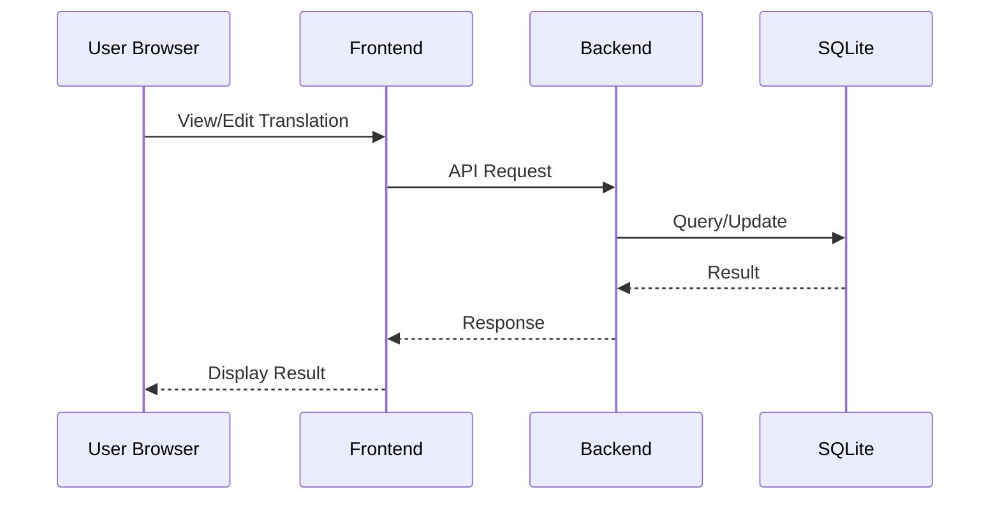
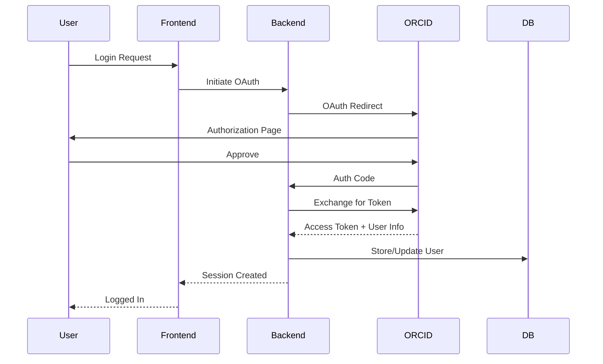
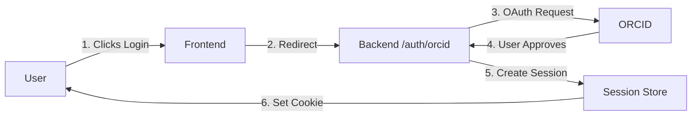
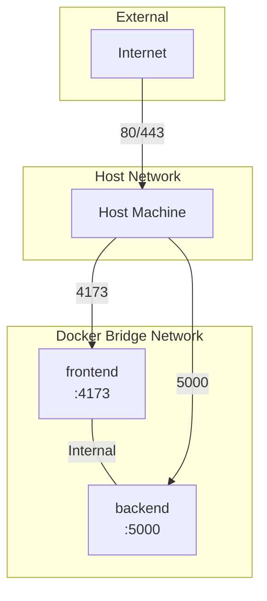
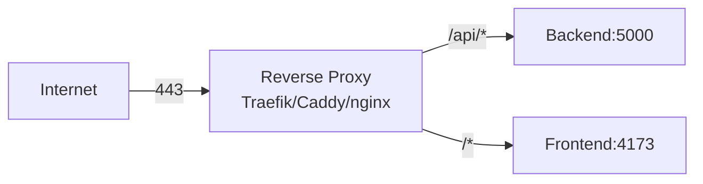

# Architecture Overview

This document provides a comprehensive overview of the Marine Term Translations (MTT) Platform architecture, including component interactions, data flow, and external service integrations.

## Table of Contents

- [High-Level Architecture](#high-level-architecture)
- [Component Descriptions](#component-descriptions)
- [Data Flow](#data-flow)
- [API Architecture](#api-architecture)
- [Authentication Flow](#authentication-flow)
- [External Services](#external-services)
- [Network Architecture](#network-architecture)

---

## High-Level Architecture

```mermaid
graph TB
    subgraph "Client Layer"
        Browser[Web Browser]
    end

    subgraph "Container Network"
        subgraph "Frontend Service"
            FE[Vite + React<br/>:4173]
        end

        subgraph "Backend Service"
            BE[Express.js API<br/>:5000]
            Swagger[Swagger Docs<br/>/api/docs]
        end

        subgraph "Data Layer"
            SQLite[(SQLite<br/>Translations DB)]
        end
    end

    subgraph "External Services"
        ORCID[ORCID OAuth]
        OpenRouter[OpenRouter API]
        EMODnet[EMODnet APIs]
    end

    Browser --> FE
    Browser --> BE
    FE --> BE
    BE --> SQLite
    BE --> ORCID
    FE -.-> OpenRouter
    BE -.-> EMODnet

    style FE fill:#61dafb,stroke:#333
    style BE fill:#68a063,stroke:#333
    style SQLite fill:#003b57,stroke:#333
```



---

## Component Descriptions

### Frontend (Vite + React)

| Attribute | Value |
|-----------|-------|
| **Technology** | React 18, Vite 6, TypeScript |
| **Port** | 4173 (preview mode) |
| **Container** | `marine-frontend` |
| **Purpose** | User interface for translation management |

**Key Features:**
- Translation browsing and editing interface
- User authentication via ORCID OAuth
- Real-time translation status updates
- OpenRouter AI integration for translation suggestions

**Configuration:**
- `VITE_API_URL`: Backend API endpoint
- `VITE_DOMAIN`: Domain for the platform

### Backend (Express.js)

| Attribute | Value |
|-----------|-------|
| **Technology** | Node.js, Express.js |
| **Port** | 5000 |
| **Container** | `marine-backend` |
| **Purpose** | REST API for translation operations |

**API Routes:**
- `/api/auth/*` - ORCID authentication endpoints
- `/api/terms/*` - Term management
- `/api/teams/*` - Team management (returns empty for now)
- `/api/appeals/*` - Appeal handling
- `/api/docs` - Swagger documentation

**Key Services:**
- `dbInit.service.js` - Database initialization
- `reputation.service.js` - User reputation system
- `harvest.service.js` - EMODnet data harvesting

### SQLite Database

| Attribute | Value |
|-----------|-------|
| **Location** | `backend/data/translations.db` |
| **Purpose** | Translation data storage |

**Schema Tables:**
- `terms` - Marine terminology
- `term_fields` - Term field definitions
- `translations` - Translation content
- `appeals` - Translation appeals
- `appeal_messages` - Appeal discussion messages
- `users` - User profiles and reputation
- `reputation_events` - Reputation tracking
- `user_activity` - Activity logging

**Features:**
- Automatic initialization on first startup
- Schema migrations via `migrations/schema.sql`
- Volume-mounted for data persistence

---

## Data Flow

### Translation Workflow



### Authentication Flow



---

## API Architecture

### REST API Structure

```
/api
├── /auth
│   ├── POST /login
│   ├── POST /logout
│   └── GET /user
├── /terms
│   ├── GET / (list terms)
│   ├── GET /:id (get term)
│   ├── POST / (create term)
│   └── PUT /:id (update term)
├── /teams
│   ├── GET / (list teams)
│   └── POST / (create team)
├── /appeals
│   ├── GET / (list appeals)
│   ├── POST / (create appeal)
│   └── PUT /:id (resolve appeal)
├── /setup-gitea
│   └── POST / (initialize Gitea org)
└── /docs
    └── Swagger UI
```

### API Documentation

Access the interactive API documentation at:
```
http://localhost:5000/api/docs
```

---

## Authentication Flow

### ORCID OAuth Integration

The platform uses ORCID as the identity provider:

1. **User Authentication**: Users log in via ORCID iD
2. **Token Generation**: ORCID issues access tokens
3. **User Info Retrieval**: Backend fetches user profile from ORCID
4. **Session Management**: Backend creates session with HttpOnly cookies

### Session Flow



---

## External Services

### ORCID

| Aspect | Details |
|--------|---------|
| **Purpose** | User authentication and identity |
| **Integration Point** | Backend OAuth flow |
| **Configuration** | `ORCID_CLIENT_ID`, `ORCID_CLIENT_SECRET` |

**Usage:**
- Single sign-on authentication
- User profile information
- Persistent user identification

### OpenRouter API

| Aspect | Details |
|--------|---------|
| **Purpose** | AI-powered translation suggestions |
| **Integration Point** | Frontend (client-side) |
| **Configuration** | `OPENROUTER_API_KEY` in environment |

**Usage:**
- Translation assistance
- Quality improvement suggestions
- Context-aware recommendations

### EMODnet APIs

| Aspect | Details |
|--------|---------|
| **Purpose** | Marine terminology data source |
| **Integration Point** | Backend API |
| **Data** | Term definitions, vocabularies |

**Integration:**
- Term imports
- Vocabulary synchronization
- Metadata enrichment

---

## Network Architecture

### Docker Network Topology



### Port Mappings

| Service | Container Port | Host Port | Purpose |
|---------|---------------|-----------|---------|
| Backend | 5000 | 5000 | REST API |
| Frontend | 4173 | 4173 | Web application |

### Container-to-Container Communication

Services communicate using Docker DNS:
- `http://backend:5000` - Backend from frontend container (if needed)

### Reverse Proxy Integration

For production, add a reverse proxy layer:



---

## Volume Mounts

### Persistent Data

| Volume | Path | Purpose |
|--------|------|---------|
| Backend Data | `./backend/data:/app/backend/data` | SQLite database |

### Benefits

- ✅ Database persists across container restarts
- ✅ Easy backup and restore
- ✅ Direct access to database file from host

---

## Security Considerations

### Secret Management

- **Environment Variables**: Store sensitive data in `.env`
- **Git Ignore**: `.env` excluded from version control
- **Session Secrets**: Strong random SESSION_SECRET required

### Network Security

- **HTTPS Required**: Production must use HTTPS for ORCID OAuth
- **CORS**: Configured for allowed origins
- **Cookies**: HttpOnly, Secure cookies for sessions

### Container Security

- **Non-root Users**: Services run as non-root where possible
- **Minimal Images**: Alpine-based images where available
- **Resource Limits**: Consider adding in production

---

## Scaling Considerations

### Horizontal Scaling

The architecture supports scaling through:
- Multiple frontend instances behind a load balancer
- Backend API replication with shared database (consider PostgreSQL migration)

### Performance Optimization

- **SQLite**: Consider PostgreSQL for high-write workloads or multiple backend instances
- **Caching**: Add Redis for session/API caching
- **CDN**: Serve frontend assets via CDN

**SQLite Limitations:**
- ✅ Suitable for single-server deployments
- ✅ Moderate traffic (< 10,000 requests/day)
- ⚠️ Not recommended for multi-server setups (use PostgreSQL instead)

---

## Development Architecture

### Local Development

```bash
# Frontend development server
cd frontend && npm run dev  # :5173

# Backend with hot reload (if configured)
cd backend && npm run dev  # :5000

# Full stack with Docker
docker compose up -d
```

### Testing

- Unit tests in respective service directories
- Integration tests against Docker Compose stack
- E2E tests with Playwright (if configured)
