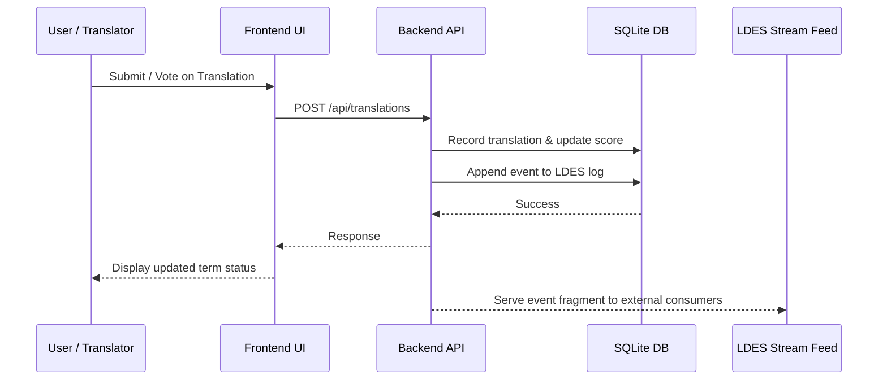

# System Architecture Overview

[](https://emodnet.ec.europa.eu/en/biology)

> [!NOTE]
> **Sponsored by EMODnet Biology**  
> Marine Term Translations (MTT) is developed within the framework of [EMODnet Biology](https://emodnet.ec.europa.eu/en/biology) (European Marine Observation and Data Network) to facilitate the internationalization, translation, and harmonization of marine science vocabularies.
> 
> *The European Marine Observation and Data Network (EMODnet) is financed by the European Union under Regulation (EU) 2021/1139 of the European Parliament and of the Council of 7 July 2021 establishing the European Maritime, Fisheries and Aquaculture Fund.*

---

## Table of Contents

- [High-Level Architecture](#high-level-architecture)
- [Component Descriptions](#component-descriptions)
- [Data Flow](#data-flow)
- [API Architecture](#api-architecture)
- [Authentication Flow](#authentication-flow)
- [External Services](#external-services)
- [Network Architecture](#network-architecture)
- [Volume Mounts](#volume-mounts)
- [Security Considerations](#security-considerations)
- [Scaling Considerations](#scaling-considerations)

---

## High-Level Architecture


```mermaid
graph TB
    subgraph "Client Layer"
        Browser[Web Browser / API Client]
    end

    subgraph "Container Network"
        subgraph "Frontend Service"
            FE[Vite + React<br/>:4173]
        end

        subgraph "Backend Service"
            BE[Express.js API<br/>:5000]
            LDES[LDES Event Streams<br/>/api/ldes]
            Swagger[Swagger Docs<br/>/api/docs]
        end

        subgraph "Data Layer"
            SQLite[(SQLite<br/>Translations DB)]
        end
    end

    subgraph "External Services"
        ORCID[ORCID OAuth]
        OpenRouter[OpenRouter API]
        EMODnet[EMODnet APIs & NVS]
    end

    Browser --> FE
    Browser --> BE
    FE --> BE
    BE --> SQLite
    BE --> ORCID
    BE --> LDES
    FE -.-> OpenRouter
    BE -.-> EMODnet

    style FE fill:#61dafb,stroke:#333
    style BE fill:#68a063,stroke:#333
    style SQLite fill:#003b57,stroke:#333
    style LDES fill:#ff9900,stroke:#333
```

---

## Component Descriptions

### Frontend (Vite + React)

| Attribute | Value |
|-----------|-------|
| **Technology** | React 18, Vite 6, TypeScript, Tailwind CSS |
| **Port** | 4173 (preview mode) / 5173 (dev mode) |
| **Container** | `marine-frontend` |
| **Purpose** | User interface for translation management, community goals, discussions, and moderation |

**Key Features:**
- Term browsing, filtering, and translation management interface
- Authentication via ORCID iD
- Community translation challenge widgets and user statistics
- OpenRouter AI integration for automated translation assistance
- Admin moderation controls and issue reporting dashboard

### Backend (Express.js)

| Attribute | Value |
|-----------|-------|
| **Technology** | Node.js 20, Express.js |
| **Port** | 5000 |
| **Container** | `marine-backend` |
| **Purpose** | REST API for translation operations, LDES feeds, ORCID auth, and admin controls |

**Key API Routes:**
- `/api/auth/*` - ORCID OAuth authentication and session endpoints
- `/api/terms/*` - Marine terminology management and search
- `/api/translations/*` - Translation submissions, votes, and status
- `/api/ldes/*` - Linked Data Event Streams (LDES) feed generation and fragment serving
- `/api/community-goals/*` - Community goal metrics and tracking
- `/api/reports/*` - Content moderation and issue reports
- `/api/docs` - Interactive Swagger API documentation

### SQLite Database

| Attribute | Value |
|-----------|-------|
| **Location** | `backend/data/translations.db` |
| **Purpose** | Persistent data store for terms, translations, users, goals, and LDES event logs |

---

## Data Flow

### Translation Lifecycle & LDES Event Flow


```mermaid
sequenceDiagram
    participant U as User / Translator
    participant FE as Frontend UI
    participant BE as Backend API
    participant DB as SQLite DB
    participant LDES as LDES Stream Feed

    U->>FE: Submit / Vote on Translation
    FE->>BE: POST /api/translations
    BE->>DB: Record translation & update score
    BE->>DB: Append event to LDES log
    DB-->>BE: Success
    BE-->>FE: Response
    FE-->>U: Display updated term status
    BE-->>LDES: Serve event fragment to external consumers
```

---

## API Architecture

### REST API Structure

```
/api
├── /auth
│   ├── GET /orcid (initiate OAuth)
│   ├── GET /orcid/callback (OAuth callback)
│   ├── GET /me (get current user)
│   └── POST /logout (logout)
├── /terms
│   ├── GET / (list & search terms)
│   ├── GET /:id (get term details)
│   └── POST / (create/import term)
├── /translations
│   ├── GET / (list translations)
│   ├── POST / (submit translation)
│   └── POST /:id/vote (upvote/downvote)
├── /ldes
│   ├── GET / (feed stream index)
│   └── GET /by-page (paged LDES event fragments)
├── /community-goals
│   └── GET / (active community challenges)
└── /docs
    └── Swagger UI
```

---

## External Services

### EMODnet & NERC Vocabularies

| Aspect | Details |
|--------|---------|
| **Purpose** | Marine terminology source data and harmonization registry |
| **Integration** | Backend API sync and link referencing |
| **URL** | `https://emodnet.ec.europa.eu/en/biology` |

### ORCID OAuth

| Aspect | Details |
|--------|---------|
| **Purpose** | Federated user authentication and author identity verification |
| **Integration** | Passport.js OAuth 2.0 backend flow |

### OpenRouter AI

| Aspect | Details |
|--------|---------|
| **Purpose** | Multi-model AI assistance for marine translation suggestions |
| **Integration** | Client-side API calls configured with user API key |

---

## License & Funding

This project is licensed under the [MIT License](LICENSE).

**Funding Acknowledgment:**  
This platform was developed with support from **EMODnet Biology** (European Marine Observation and Data Network), financed by the European Union under Regulation (EU) 2021/1139 of the European Parliament and of the Council of 7 July 2021 establishing the European Maritime, Fisheries and Aquaculture Fund.
