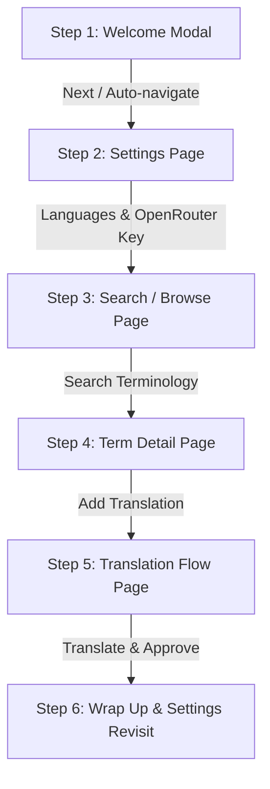

# Onboarding Product Tour Design Specification

**Date**: 2026-07-30  
**Status**: Updated (Multi-Page Expansion)  
**Branch**: `onboarding`  

---

## 1. Overview
The Onboarding Product Tour feature provides a guided interactive product tour for first-time users covering all major application areas: Settings (Language preferences & OpenRouter API key), Search/Browse, Term Detail page (submitting translations), and Translation Flow (rapid translating & reviewing/approving).

The tour uses dynamic page routing (`useNavigate`), dimmed element-spotlight backdrops, action-driven progression, skip/opt-out buttons on every step, and state persistence in the user database (`has_seen_onboarding`).

---

## 2. Requirements & User Experience

### 2.1 Multi-Page Tour Sequence

1. **Step 1: Welcome & Overview** (Center Modal on Login)
   - **Target**: `data-tour="welcome"`
   - **Title**: "Welcome to MTT!"
   - **Content**: "Let's take a quick guided tour of MTT: setting up your languages & API key, searching terms, contributing translations, and reviewing translations in the flow."
   - **Controls**: "Start Guided Tour", "Skip Tutorial".

2. **Step 2: Settings Page Tour (Languages & OpenRouter API Key)**
   - **Route**: Navigates to `/settings`
   - **Sub-step 2a Target**: `data-tour="settings-languages"`
     - **Title**: "Language Preferences"
     - **Content**: "Select your native language and the target languages you translate between."
   - **Sub-step 2b Target**: `data-tour="settings-api-key"`
     - **Title**: "OpenRouter API Key"
     - **Content**: "Enter your OpenRouter API key here to unlock AI-assisted translation suggestions."
   - **Controls**: "Next", "Skip Tutorial".

3. **Step 3: Search / Browse Page Tour**
   - **Route**: Navigates to `/browse` (or `/dashboard` search)
   - **Target**: `data-tour="search-input"`
   - **Title**: "Search Terminology"
   - **Content**: "Type any marine or scientific term here to search exact matches, synonyms, and context notes across languages."
   - **Controls**: "Next", "Skip Tutorial".
   - **Action-Driven Trigger**: Typing in search bar automatically advances to Step 4.

4. **Step 4: Term Detail Page Tour (Submitting Translations)**
   - **Route**: Navigates to `/terms/:id` (or sample term detail)
   - **Target**: `data-tour="add-translation-btn"`
   - **Title**: "Contribute Translations"
   - **Content**: "View detailed definition context here and submit your own translations with references for community review."
   - **Controls**: "Next", "Skip Tutorial".

5. **Step 5: Translation Flow Page Tour (Rapid Translation & Approval)**
   - **Route**: Navigates to `/flow`
   - **Target**: `data-tour="flow-actions"`
   - **Title**: "Translation & Approval Flow"
   - **Content**: "Use this rapid flow workspace to quickly translate missing terms or vote to approve community contributions."
   - **Controls**: "Next", "Skip Tutorial".

6. **Step 6: Wrap Up & Settings Revisit**
   - **Route**: Navigates to `/settings#help`
   - **Target**: `data-tour="settings-help"`
   - **Title**: "Tour Complete!"
   - **Content**: "That's it! You can replay this full tour or specific micro-tours anytime from the Help & Onboarding section in your Settings."
   - **Controls**: "Finish Tour", "Skip Tutorial".

---

### 2.2 Settings Page "Help & Onboarding" & Micro-Tours
- In `Settings.tsx`, add a dedicated **Help & Onboarding** dashboard section.
- **Tour Triggers**:
  - **"Replay Full Platform Tour"** (`startTour('full')`)
  - **"Tour: Settings & API Key Setup"** (`startTour('settings')`)
  - **"Tour: Searching Terminology"** (`startTour('search')`)
  - **"Tour: Term Details & Translations"** (`startTour('term_detail')`)
  - **"Tour: Translation & Approval Flow"** (`startTour('flow')`)

---

## 3. Architecture & Data Flow

### Route-Aware Tour Engine (`OnboardingContext.tsx`)
- Step definitions specify optional `route` property (e.g. `/settings`, `/browse`, `/terms/1`, `/flow`).
- When advancing steps, `OnboardingContext` checks if current location matches `step.route`. If not, it executes `navigate(step.route)` and waits for the target element (`data-tour="..."`) to mount before opening the tooltip popover.

---

## 4. Element Selectors (`data-tour` Mapping)
- `data-tour="settings-languages"`: Language selection card in `Settings.tsx`.
- `data-tour="settings-api-key"`: OpenRouter API key input in `Settings.tsx`.
- `data-tour="search-input"`: Main search bar input in `Browse.tsx` / `Dashboard.tsx`.
- `data-tour="add-translation-btn"`: Translation contribution panel in `TermDetail.tsx`.
- `data-tour="flow-actions"`: Action buttons (Translate / Approve / Reject) in `TranslationFlow.tsx`.
- `data-tour="settings-help"`: Help & Onboarding card in `Settings.tsx`.

---

## 5. Persistence & Database Schema
- `has_seen_onboarding` boolean stored in database user preferences.
- Saved as `1` (`true`) as soon as user completes or clicks "Skip Tutorial" on any step during the initial login flow.

---

## 6. Testing Plan (TDD Requirements)
- **Backend Tests**:
  - Database schema & preference API endpoints tests (`has_seen_onboarding`).
- **Frontend Tests**:
  - Route navigation during tour steps (`OnboardingContext` switching routes automatically).
  - Micro-tours execution (`startTour('settings')`, `startTour('flow')`, etc.).
  - Target element highlighting and tooltip rendering.
  - Skip functionality updating backend state.
