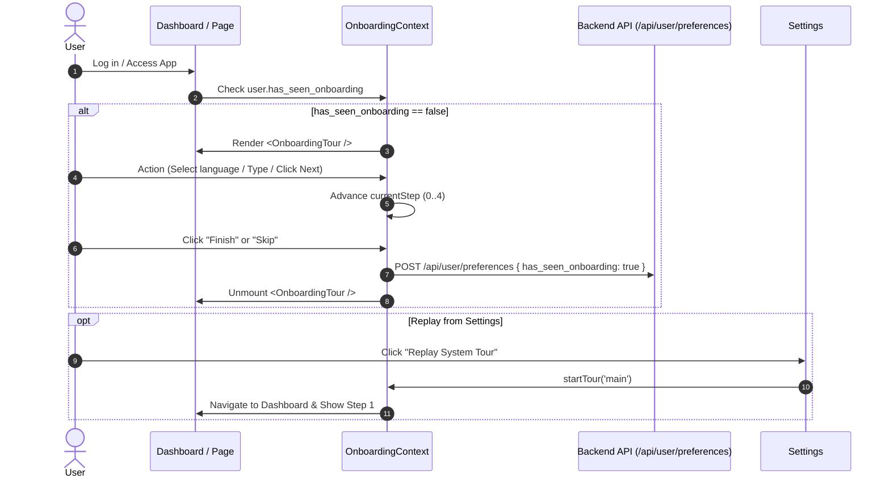

# Onboarding Product Tour Design Specification

**Date**: 2026-07-30  
**Status**: Approved  
**Branch**: `onboarding`  

---

## 1. Overview
The Onboarding Product Tour feature provides a 5-step interactive product tour for first-time users on the MTT translation platform. The tour highlights live screen elements with tooltips, dark backdrop overlays, action-driven progression, skip/opt-out buttons on every step, and state persistence in the user database.

---

## 2. Requirements & User Experience

### 2.1 The "Rule of 5" Tour Steps
1. **Step 1: Welcome & Value Proposition** (Center Modal)
   - **Target**: `data-tour="welcome"` (Centered modal overlay on screen)
   - **Title**: "Welcome to MTT!"
   - **Content**: "Let's take a quick look at how to find accurate terminology across different languages."
   - **Controls**: "Get Started" (Next), "Skip Tutorial".

2. **Step 2: Language Pair Selection** (Element Tooltip)
   - **Target**: `data-tour="language-selector"`
   - **Title**: "Language Pair Selection"
   - **Content**: "Start by selecting your source language and your target language. You can easily swap these using the arrows."
   - **Controls**: "Next", "Skip Tutorial".
   - **Action-Driven Trigger**: Changing source/target language automatically advances to Step 3.

3. **Step 3: Search Input** (Element Tooltip)
   - **Target**: `data-tour="search-bar"`
   - **Title**: "Search Terminology"
   - **Content**: "Type your term here. Our system will look for exact matches and related scientific context."
   - **Controls**: "Next", "Skip Tutorial".
   - **Action-Driven Trigger**: Typing in search bar automatically advances to Step 4.

4. **Step 4: Results & Context** (Element Tooltip)
   - **Target**: `data-tour="results-area"`
   - **Title**: "Results & Context"
   - **Content**: "Here you'll see the translation. Pay attention to the context notes to ensure it's the correct term for your specific use case."
   - **Controls**: "Next", "Skip Tutorial".

5. **Step 5: Wrap Up & Settings** (Element Tooltip)
   - **Target**: `data-tour="settings-icon"` (Points to profile/settings icon in top nav)
   - **Title**: "You're All Set!"
   - **Content**: "That's it! If you ever need to see this guide again, you can find it in your Settings. Try translating your first term now."
   - **Controls**: "Finish Tour", "Skip Tutorial".

### 2.2 Replaying Tour from Settings
- Add **Help & Onboarding** card/section in `Settings.tsx`.
- Button: **"Replay System Tour"** / **"How to use MTT"**.
- Action: Clicking redirects user to translation dashboard (`/` or `/dashboard`) and resets tour state to Step 1 (`startTour('main')`).

---

## 3. Architecture & Data Flow

---

## 4. Component Structure (Approach A)

### Frontend Components (`frontend/`)
- `frontend/context/OnboardingContext.tsx`: Manages tour state (`activeTour`, `currentStep`, `hasSeenOnboarding`), methods (`startTour`, `nextStep`, `prevStep`, `skipTour`, `completeTour`).
- `frontend/components/onboarding/OnboardingTour.tsx`: Main tour component rendering backdrop and tooltip popover.
- `frontend/components/onboarding/TourBackdrop.tsx`: Dark SVG overlay mask with highlighted cutout around target DOM element.
- `frontend/components/onboarding/TourTooltip.tsx`: Card positioned near target element with arrow indicator, step details, action buttons.

### Data Attributes Demarcation
- `data-tour="language-selector"` on language selector controls in header/dashboard.
- `data-tour="search-bar"` on term search input.
- `data-tour="results-area"` on results container / translation list.
- `data-tour="settings-icon"` on navigation settings link / profile avatar.

---

## 5. Backend Database Schema & API

### Schema Update (`backend/src/db.js` / migration)
- Store `has_seen_onboarding` boolean in `user_preferences` table or user metadata JSON (default `0` / `false`).

### Endpoints
- `GET /api/user/preferences`: Returns `{ ..., has_seen_onboarding: boolean }`.
- `POST /api/user/preferences`: Updates user preferences including `has_seen_onboarding`.

---

## 6. Testing Plan (TDD Requirements)

Following Test-Driven Development rules:
1. **Backend Tests** (`backend/tests/onboarding.test.js` or `backend/tests/preferences.test.js`):
   - Test default `has_seen_onboarding` preference value for new user.
   - Test updating `has_seen_onboarding` to `true` via API endpoint.
2. **Frontend Tests** (`frontend/tests/onboarding.test.tsx`):
   - Unit tests for `OnboardingContext` state transitions.
   - Integration tests verifying tour renders when `has_seen_onboarding = false`.
   - Test Skip button marks tour as completed/skipped and calls API.
   - Test Next/Action-driven step progression.
   - Test Settings "Replay System Tour" button triggers tour restart and navigation.
